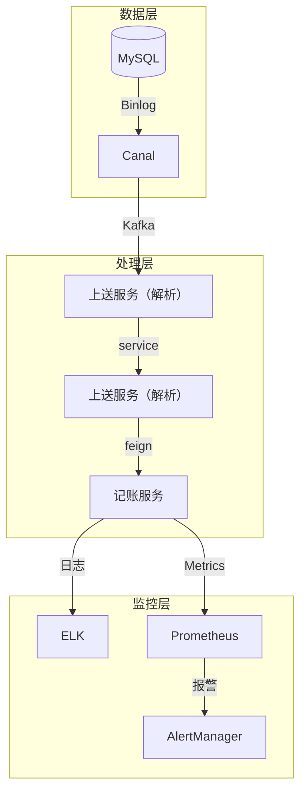

```mermaid
graph TB
    subgraph 数据层
        DB[(MySQL)] -->|Binlog| Canal
    end
    subgraph 处理层
        Canal -->|Kafka| Parser[上送服务（解析）]
        Parser -->|service| Engine[上送服务（解析）]
        Engine -->|feign| Accounting[记账服务]
    end
    subgraph 监控层
        Accounting -->|日志| ELK
        Accounting -->|Metrics| Prometheus
        Prometheus -->|报警| AlertManager
    end
```