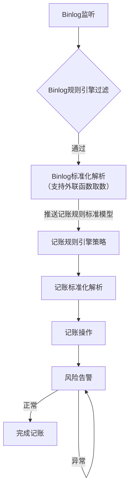

```mermaid
graph TD
    A[Binlog监听] --> B{Binlog规则引擎过滤}
    B -->|通过| C[Binlog标准化解析
    （支持外联函数取数）]
    C --> |推送记账规则标准模型|D[记账规则引擎策略]
    D --> E[记账标准化解析]
    E --> F[记账操作]
    F --> G[自查校验]
    G -->|异常| G[风险告警]
     -->|正常| H[完成记账]
```