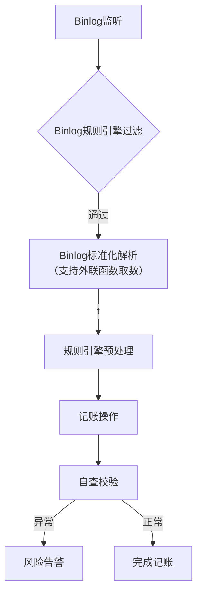

```mermaid
graph TD
    A[Binlog监听] --> B{Binlog规则引擎过滤}
    B -->|通过| C[Binlog标准化解析
    （支持外联函数取数）]
    C --> |t|D[规则引擎预处理]
    D --> E[记账操作]
    E --> F[自查校验]
    F -->|异常| G[风险告警]
    F -->|正常| H[完成记账]
```