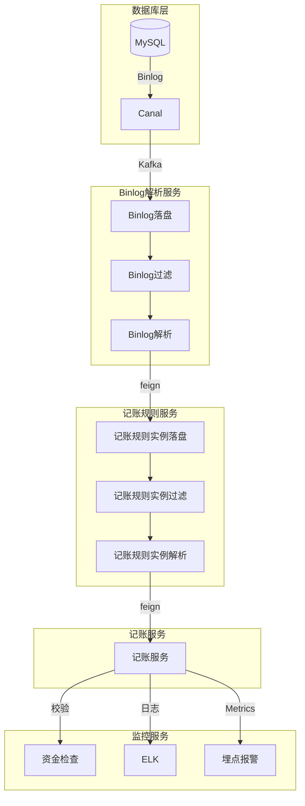

```mermaid
graph TB
    subgraph 数据库层
        DB[(MySQL)] -->|Binlog| Canal
    end
    subgraph Binlog解析服务
        Canal -->|Kafka| Binlog[Binlog落盘]
        Binlog --> Binlog1[Binlog过滤]
        Binlog1 --> Binlog2[Binlog解析]
    end
    subgraph 记账规则服务
        Binlog2 -->|feign| AccountingRule[记账规则实例落盘]
        AccountingRule --> AccountingRule1[记账规则实例过滤]
        AccountingRule1 --> AccountingRule2[记账规则实例解析] 
    end
    subgraph 记账服务
       AccountingRule2 -->|feign| Accounting[记账服务]
    end
    subgraph 监控服务
        Accounting --> |校验| 资金检查
        Accounting -->|日志| ELK
        Accounting -->|Metrics| 埋点报警
    end
```