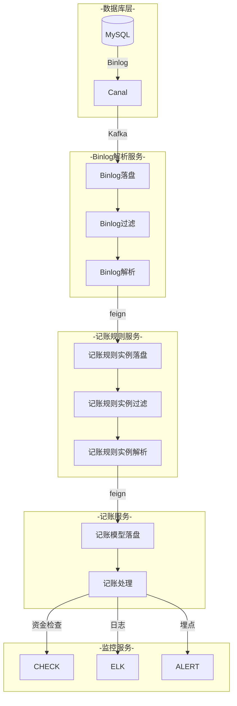

```mermaid
graph TB
    subgraph -数据库层-
        DB[(MySQL)] -->|Binlog| Canal
    end
    subgraph -Binlog解析服务-
        Canal -->|Kafka| Binlog[Binlog落盘]
        Binlog --> Binlog1[Binlog过滤]
        Binlog1 --> Binlog2[Binlog解析]
    end
    subgraph -记账规则服务-
        Binlog2 -->|feign| AccountingRule[记账规则实例落盘]
        AccountingRule --> AccountingRule1[记账规则实例过滤]
        AccountingRule1 --> AccountingRule2[记账规则实例解析] 
    end
    subgraph -记账服务-
       AccountingRule2 -->|feign| Accounting[记账模型落盘]
       Accounting --> Accounting1[记账处理]
    end
    subgraph -监控服务-
        Accounting1 --> |资金检查| CHECK
        Accounting1 -->|日志| ELK
        Accounting1 -->|埋点| ALERT
    end
```