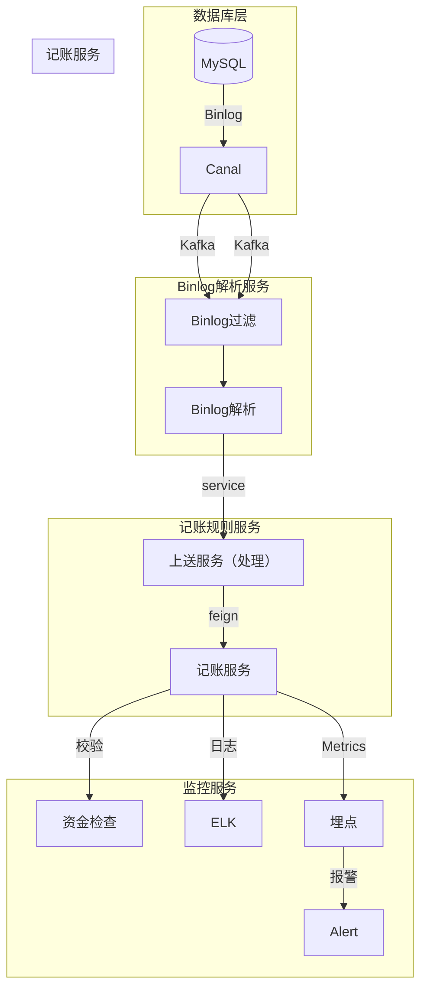

```mermaid
graph TB
    subgraph 数据库层
        DB[(MySQL)] -->|Binlog| Canal
    end
    subgraph Binlog解析服务
        Canal -->|Kafka| Parser1[Binlog过滤]
        Canal -->|Kafka| Parser1[Binlog过滤]
        Parser1 --> Parser2[Binlog解析]
    end
    subgraph 记账规则服务
        Parser2 -->|service| Engine[上送服务（处理）]
        Engine -->|feign| Accounting[记账服务]
    end
    subgraph 记账服务
       
    end
    subgraph 监控服务
        Accounting --> |校验| 资金检查
        Accounting -->|日志| ELK
        Accounting -->|Metrics| 埋点
        埋点 -->|报警| Alert
    end
```