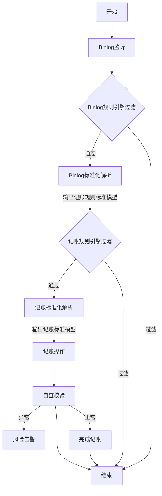

```mermaid
graph TD
    Z[开始] --> A
    A[Binlog监听] --> B{Binlog规则引擎过滤}
    B -->|通过| C[Binlog标准化解析]
    B -->|过滤| K[结束]
    C --> |输出记账规则标准模型|D{记账规则引擎过滤}
    D --> |通过|E[记账标准化解析]
    D --> |过滤|K
    E --> |输出记账标准模型|F[记账操作]
    F --> G[自查校验]
    G -->|异常| H[风险告警]
    G -->  K[结束]
    G -->|正常| I[完成记账]
    I -->  K[结束]
```